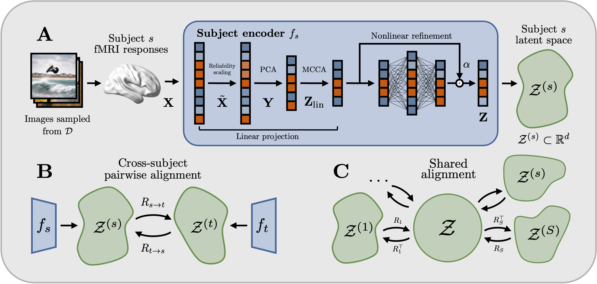

# Platonic Representations in the Human Brain: Unsupervised Recovery of Universal Geometry

[](https://www.python.org/downloads/release/python-3100/)
[](https://arxiv.org/abs/2605.20496v1)


The Strong Platonic Representation Hypothesis suggests that representational convergence in artificial neural networks can be harnessed constructively: embeddings can be translated across models through a universal latent space without paired data. We ask whether an analogous geometry can be recovered across human brains. Using fMRI data from the Natural Scenes Dataset, we propose a self-supervised encoder that learns subject-specific embeddings from brain data alone by exploiting repeated stimulus presentations. We show that these independently learned spaces can be translated across subjects using unsupervised orthogonal rotations, without paired cross-subject samples or intermediate model representations. Synchronizing pairwise rotations into a single shared latent space further improves cross-subject retrieval, indicating that subject-specific spaces are mutually compatible with a common coordinate system. These results provide evidence for a shared neural geometry in the human visual cortex: subject-specific fMRI representations are approximately isometric across individuals and can be translated through purely geometric transformations.




**(A) Subject encoder.** For each subject, fMRI responses are mapped into a low-dimensional embedding space using voxel reliability weighting, PCA, and multi-view CCA (MCCA), followed by a residual nonlinear refinement trained from repeated stimulus presentations.
**(B) Pairwise brain-to-brain translation.** Independently learned subject embeddings are translated between subject pairs by estimating orthogonal rotations $R_{s\rightarrow t}$ from geometry-derived pseudo-correspondences.
**(C) Shared latent space.** Pairwise rotations are synchronized to recover one orthogonal transformation $R_s$ per subject, mapping all subject embeddings into a common space.


---

## Data

This project uses the **Natural Scenes Dataset (NSD)**. The dataset must be downloaded from the official open repository after accepting the dataset terms and conditions:

https://registry.opendata.aws/nsd/

Before running the scripts, make sure the local paths to the NSD data are correctly configured in:

[`src/fmri_mapping/io/nsd.py`](src/fmri_mapping/io/nsd.py)

To extract beta responses for a given ROI/parcellation, run:

[`scripts/0_nsd_organize_betas.py`](scripts/0_nsd_organize_betas.py)

In the paper, we use the **volumetric 1 mm GLM beta estimates** and the **NSDGeneral** ROI mask.

---

## Main pipeline

The main analysis pipeline is organized as follows.

### 1. Train the linear subject encoder

[`scripts/1_within_subject_linear.py`](scripts/1_within_subject_linear.py)

Trains the linear part of the subject-specific encoder. This includes voxel reliability weighting, PCA, and MCCA-based linear embedding construction. The script saves the learned matrices and resulting embeddings for each subject.

### 2. Train the nonlinear residual refinement

[`scripts/2_within_subject_mlp.py`](scripts/2_within_subject_mlp.py)

Uses the output of the linear encoder to train a residual MLP refinement with repetition-based self-supervision. The script saves the trained nonlinear encoder and the final embeddings for each subject.

The default parameters correspond to those used in the paper.

### 3. Standardize and average embeddings

[`scripts/3_standarize_embeddings.py`](scripts/3_standarize_embeddings.py)

Converts the subject embeddings into a standardized format for cross-subject analyses. This includes averaging embeddings across repeated presentations to obtain one representation per image.

### 4. Learn pairwise brain-to-brain rotations

[`scripts/4_mini_vec2vec_alignment.py`](scripts/4_mini_vec2vec_alignment.py)

Runs the mini-vec2vec-based unsupervised translation procedure to estimate pairwise orthogonal rotations between subjects. The script saves the resulting pairwise transformation matrices.

### 5. Synchronize rotations into a shared latent space

[`notebooks/1_pairwise_and_global_alignment.ipynb`](notebooks/1_pairwise_and_global_alignment.ipynb)


Loads the pairwise rotations, evaluates pairwise translation, and performs orthogonal synchronization to recover one transformation per subject into a shared latent space.

---

## Notes

- The code assumes that NSD data are available locally and that paths are configured in `src/fmri_mapping/io/nsd.py`.

- Scripts save intermediate `.pt` files that are used by later stages of the pipeline.

- The default script parameters correspond to the main experiments reported in the paper unless otherwise specified.


## Cite

```
@misc{marcosmanchon2026platonic,
      title={Platonic Representations in the Human Brain: Unsupervised Recovery of Universal Geometry}, 
      author={Pablo Marcos-Manchón and Rishi Jha and Lluís Fuentemilla},
      year={2026},
      eprint={2605.20496},
      archivePrefix={arXiv},
      primaryClass={q-bio.NC},
      url={https://arxiv.org/abs/2605.20496}, 
}
```
